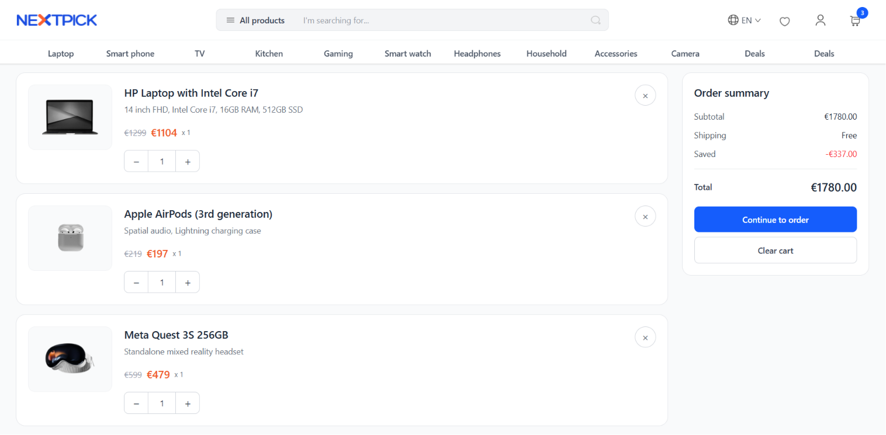
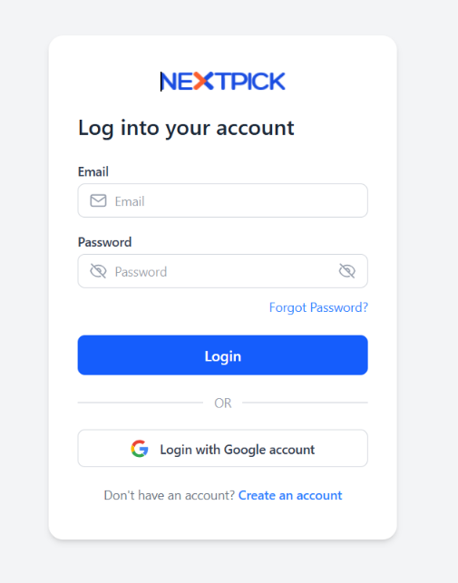
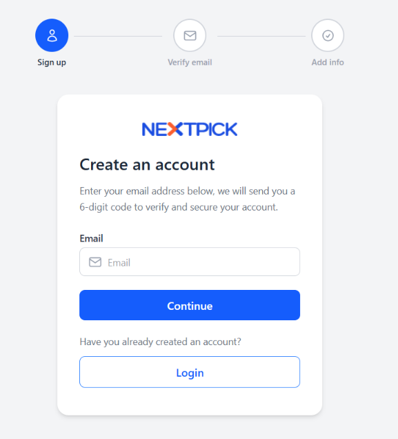
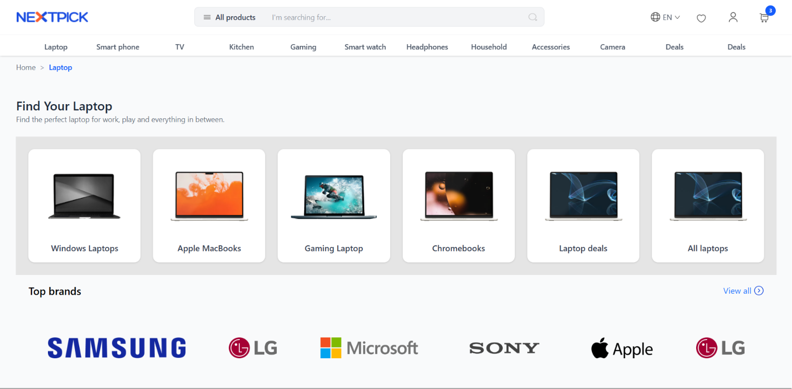

# 🛒 Angular E-Commerce

A modern e-commerce web application built with **Angular 21** and **TypeScript**. The application provides a responsive shopping experience with product browsing, authentication, cart management, and an admin inventory dashboard.

---

## 🚀 Live Demo

> https://angular-capstone.vercel.app/

---

## 📖 Overview

This project was developed as an end-to-end Angular application demonstrating modern frontend development practices, including standalone components, lazy loading, state management, routing, and responsive UI design.

The application allows users to browse products, search and filter items, manage their shopping cart, authenticate securely, and access admin functionality for inventory management.

---

## ✨ Features

### 👤 Authentication
- User Registration
- User Login
- Forgot Password
- Email Verification
- JWT-based Authentication

### 🛍️ Shopping
- Product Listing
- Product Details
- Search Products
- Product Categories
- Wishlist
- Shopping Cart
- Quantity Management

### 📦 Product Management
- Pagination
- Sorting
- Product Filtering
- Responsive Product Grid

### 👨‍💼 Admin
- Inventory Dashboard
- Add Products
- Update Products
- Delete Products

### ⚡ Performance
- Lazy Loaded Routes
- Standalone Components
- Optimized Angular Build
- Responsive Design

---

## 🛠️ Tech Stack

### Frontend
- Angular 21
- TypeScript
- RxJS
- Angular Router
- Angular Signals
- HTML5
- CSS3

### Tools
- Angular CLI
- npm
- Git
- GitHub
- Vercel

---

## 📂 Project Structure

```
src/
├── app/
│   ├── components/
│   ├── pages/
│   ├── services/
│   ├── models/
│   ├── guards/
│   ├── interceptors/
│   └── shared/
├── public/
└── assets/
```

---

## 📸 Screenshots

### Home Page


### Product Details


### Shopping Cart



### Login/Register





### Product Page



---

## ⚙️ Installation

Clone the repository

```bash
git clone https://github.com/Divyansh2130/angular-ecommerce.git
```

Navigate into the project

```bash
cd angular-ecommerce
```

Install dependencies

```bash
npm install
```

Run the development server

```bash
ng serve
```

Open

```
http://localhost:4200
```

---

## 📦 Production Build

```bash
ng build
```

---

## 🔮 Future Improvements

- Payment Gateway Integration
- Order History
- Product Reviews
- User Profile
- Dark Mode
- Wishlist Synchronization
- Recommendation Engine

---

## 👨‍💻 Author

**Divyansh Doshi**

GitHub: https://github.com/Divyansh2130

LinkedIn: https://www.linkedin.com/in/divyansh-doshi-39785a23b/

---

## 📄 License

This project is licensed under the MIT License.
